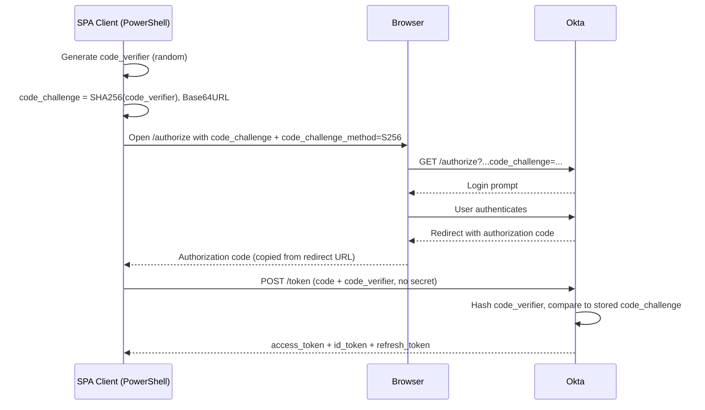

# 06 - PKCE Authorization Code Flow and Refresh Token Rotation

## Objective
Implement a PKCE-protected Authorization Code flow against a public client
(no client secret) in Okta, and validate refresh token issuance and rotation
using the `offline_access` scope.

## Context
Builds on `01-oidc-web-app.md`, `02-access-policy-token-verification.md`, and
`04-authorization-code-flow-e2e.md`, which covered the standard Authorization
Code grant for a confidential web app. This entry uses a different client
type entirely: a Single-Page App (SPA) integration, which Okta treats as a
public client. Public clients can't hold a secret safely (the code runs in
the browser), so Okta enforces PKCE automatically instead of client secret
authentication.

## What I Built

1. Created a new **Single-Page App (SPA)** integration in Okta named
   **IAM Lab SPA Client**, separate from the existing confidential OIDC web
   app, since a public client shouldn't share an app registration with a
   confidential one.
2. Confirmed the app's Client Credentials showed **Client authentication:
   None** and **Proof Key for Code Exchange (PKCE): Require PKCE as
   additional verification** checked automatically, not something I toggled
   on manually. Okta enforces PKCE by default for this app type because
   there's no secret to fall back on.
3. Enabled both **Authorization Code** and **Refresh Token** as grant types
   on the app.
4. Added a new **Access Policy** (`IAM Lab SPA Client Policy`) on the
   default Authorization Server, scoped specifically to the SPA client
   rather than "All clients," with a rule (`Auth Code + PKCE + Refresh`)
   allowing the Authorization Code grant type.
5. Generated a PKCE `code_verifier` and `code_challenge` pair in
   PowerShell:
   - `code_verifier`: a cryptographically random 32-byte value, Base64URL-encoded.
   - `code_challenge`: the SHA-256 hash of the `code_verifier`, also
     Base64URL-encoded.
6. Built and loaded an `/authorize` URL including `code_challenge`,
   `code_challenge_method=S256`, and `scope=openid profile offline_access`
   (the `offline_access` scope is what causes Okta to issue a refresh token
   alongside the access and ID tokens).
7. Logged in, captured the returned authorization `code`, and exchanged it
   for tokens via `curl`/`Invoke-RestMethod`, sending the original
   `code_verifier` instead of a client secret.
8. Used the returned `refresh_token` to request a new access token via a
   separate `grant_type=refresh_token` request, with no browser interaction
   and no PKCE proof required.

## PKCE Flow



## Issue Encountered #1: Client ID Character Mismatch

Every `/authorize` request returned a generic `400 Bad Request` with no
detail in the browser, and **zero matching entries in Okta's System Log**
when searched by client ID. That absence was itself the clue: Okta was
rejecting the request before it could even resolve which client was asking,
which pointed away from a scope or policy problem (those fail *after* the
client is identified, and do log) and toward something wrong in the request
itself.

Root cause: the client ID had been transcribed with a lowercase `l` where
the actual value used an uppercase `I` (`...4pIvE8G698` vs `...4plvE8G698`).
Both render nearly identically in most UI fonts. Copying the value directly
via Okta's clipboard icon (instead of reading and retyping it) confirmed
the mismatch and fixed it immediately. Verified by testing with a stripped
URL (scope-only, no PKCE) and a private browsing window to eliminate stale
cookies and cached scope issues as possible causes before finding the real
one.

## Issue Encountered #2: PKCE Verification Failed vs. Expired Code

After fixing the client ID, two different errors showed up at the token
exchange step:

```json
{"error":"invalid_grant","error_description":"The authorization code is invalid or has expired."}
{"error":"invalid_grant","error_description":"PKCE verification failed."}
```

These point to two different problems. The **expired code** error is a
timing issue: authorization codes are single-use and expire in roughly 60
seconds (same constraint as `04-authorization-code-flow-e2e.md`), so any
delay between copying the code and exchanging it (switching windows,
screenshotting, re-reading instructions) burns it. The **PKCE verification
failed** error is a proof mismatch: the `code_verifier` sent at token
exchange didn't hash to the `code_challenge` sent at `/authorize`, most
likely because the URL was rebuilt or retyped between the two steps instead
of both coming from the exact same `code_challenge` value in memory.

Fix: built the `/authorize` URL directly inside PowerShell using the live
`$codeChallenge` variable and opened it with `Start-Process`, removing any
manual retyping or address-bar autocomplete risk, and used a try/catch
block around `Invoke-RestMethod` to surface Okta's actual JSON error body
instead of a generic 400 exception message, so the real reason was visible
during troubleshooting.

## Verification

- PowerShell output confirmed a successful token response after the code
  fix: `token_type: Bearer`, `scope: offline_access profile openid`, and a
  populated `refresh_token`.
- Used the `refresh_token` in a second, separate request
  (`grant_type=refresh_token`, no `code_verifier`, no browser) and received
  a **new** `access_token` and a **new, rotated** `refresh_token`, confirming
  Okta rotates refresh tokens by default on use rather than reusing the same
  one indefinitely.
- (Screenshot: 06-token-exchange-success.png)
- (Screenshot: 06-refresh-token-rotation.png)

## Key Takeaway

PKCE and refresh tokens solve different problems at different points in the
flow. PKCE proves, once, that the client exchanging the authorization code
is the same client that started the login — it protects a single exposed
moment in the browser. A refresh token is a durable credential handed
directly to the app over a private server-to-server request, so possessing
it *is* the proof; no PKCE, no browser, and no user interaction is needed to
use it. Debugging both errors also reinforced a habit worth keeping:
generic error messages (a bare 400, a missing System Log entry) are a signal
to isolate variables one at a time rather than guess, and to make error
response bodies visible in tooling instead of letting exceptions swallow
them.
