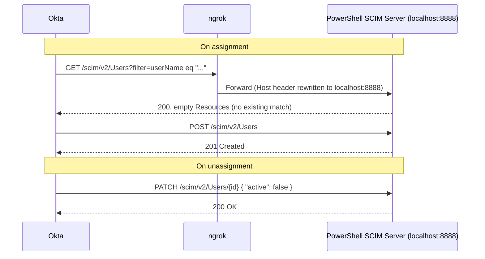

# 07 - SCIM 2.0 Outbound Provisioning

## Objective
Build a working SCIM 2.0 outbound provisioning integration in Okta, standing
up my own minimal SCIM server as the target instead of testing against a
real downstream app, so I could see the full request/response cycle for
user create and deactivate rather than just a green checkmark in the UI.

## Environment

- Okta Integrator Free Plan org
- Windows PowerShell 5.1 (`System.Net.HttpListener`, no PowerShell 7-only
  cmdlets)
- ngrok (free tier) for a public HTTPS tunnel to `localhost:8888`
- Okta's pre-built **SCIM 2.0 Test App (Header Auth)** from the OIN App
  Catalog

## Context
The earlier entries in this repo cover authentication — proving who a user
is and what claims end up in their token. This entry covers a different
part of Okta: provisioning, where Okta pushes user account lifecycle
changes (create, update, deactivate) out to a downstream system on its own,
without an admin doing it by hand.

## What I Built

1. Added Okta's pre-built **SCIM 2.0 Test App (Header Auth)** from the App
   Catalog (not the "Create a new app integration" OIN wizard, which is for
   publishing your own app to the catalog, not consuming an existing one).
2. Set the sign-on method to **Secure Web Authentication (SWA)** with a
   placeholder login URL, since SSO wasn't the point of this entry — only
   the provisioning side mattered.
3. Wrote a minimal SCIM 2.0 server in PowerShell
   (`07-scim-outbound-provisioning.ps1`, included in this repo) using
   `System.Net.HttpListener`, implementing:
   - `GET /scim/v2/ServiceProviderConfig` and `/ResourceTypes`
     (unauthenticated capability-discovery endpoints Okta probes first)
   - `GET /scim/v2/Users` with `filter=userName eq "..."` support
   - `POST /scim/v2/Users` (create)
   - `GET` / `PUT` / `PATCH` / `DELETE` on `/scim/v2/Users/{id}`
   - Bearer token authentication
   - An in-memory user store (resets on restart — fine for a lab harness)
4. Installed ngrok to expose `localhost:8888` over HTTPS, since Okta needs
   a public HTTPS endpoint to call.
5. Pointed Okta's Provisioning → Integration → Base URL at the ngrok
   forwarding URL plus `/scim/v2`, with the API Token matching the bearer
   token configured in the script.
6. Assigned myself to the app to trigger provisioning, then unassigned
   myself to trigger deactivation.

## Request Flow



## Issues, Root Causes, and Fixes

| # | Symptom | Root Cause | Fix |
|---|---------|------------|-----|
| 1 | `Test API Credentials` failed: `Invalid JSON: Unexpected character ('<')` | `HttpListener` was registered only for `http://localhost:8888/`; Windows checks the incoming `Host` header against that exact registration. ngrok forwards the original public Host header (the ngrok subdomain) by default instead of rewriting it, so the request was rejected by Windows before my script ever ran. | Restarted ngrok with `ngrok http --host-header=rewrite 8888` |
| 2 | `Test API Credentials` failed: `Invalid or missing bearer token` | Okta's "Header Auth" app sends whatever is typed into the API Token field as the raw `Authorization` header value, with no `Bearer` prefix. My auth check only accepted the exact string `Bearer <token>`. | Updated the auth check to accept either form (see snippet below) |
| 3 | Assignment failed: `Matching user not found` | "Enable API Integration" only sets up the connection and credentials — it does not grant permission for any specific provisioning action. Those are separate toggles under Provisioning → **To App** (Create Users, Update User Attributes, Deactivate Users), all off by default. With Create Users off, Okta would only ever search for a matching user, never create one. | Enabled all three toggles, then removed and re-added the assignment |

### Diagnosing #1 and #2

Both of these were only diagnosable by looking at raw traffic, not the Okta
UI's error message alone. ngrok's local inspector (`127.0.0.1:4040`) shows
the exact request and response bytes passing through the tunnel:

- For #1, the response body was a literal Windows/http.sys HTML error page
  (`400 Bad Request - Invalid Hostname`), not SCIM JSON — a sign the
  request never reached my PowerShell code at all.
- For #2, the request headers showed `Authorization: IAMLab-SCIM-Secret-2026`
  with no scheme prefix, confirming the mismatch directly instead of
  guessing at it.

### Fix for #2, in code

```powershell
function Test-Auth {
    param($Context)
    $authHeader = $Context.Request.Headers["Authorization"]
    if ($authHeader -ne "Bearer $ApiToken" -and $authHeader -ne $ApiToken) {
        Send-ScimError -Context $Context -StatusCode 401 `
            -Detail "Invalid or missing bearer token"
        return $false
    }
    return $true
}
```

### Fix for #2, tooling note

The first attempt to make this edit in Notepad++ (Find & Replace) silently
did nothing — no error, but the file was unchanged. I only caught it by
grepping the file afterward:

```powershell
Select-String -Path .\scim-server.ps1 -Pattern "authHeader -ne"
```

which showed the original line was still there. Made the edit directly
from PowerShell instead:

```powershell
(Get-Content .\scim-server.ps1) `
  -replace [regex]::Escape('if ($authHeader -ne "Bearer $ApiToken") {'), `
    'if ($authHeader -ne "Bearer $ApiToken" -and $authHeader -ne $ApiToken) {' `
  | Set-Content .\scim-server.ps1
```

## Verification

Terminal log from the SCIM server, showing the full working sequence after
all three fixes:

```
2026-08-31T15:21:24Z  POST  /scim/v2/Users
  -> created user 'u.rai@vikes.csuohio.edu' (id: 5aa71f0e-b960-44e8-9108-67eb43ac9243)
2026-08-31T15:23:00Z  PATCH  /scim/v2/Users/5aa71f0e-b960-44e8-9108-67eb43ac9243
  -> u.rai@vikes.csuohio.edu active set to False
```

The `POST` fired when I assigned myself to the app in Okta, and returned a
`201` with the created user's SCIM representation. The `PATCH` fired when
I unassigned myself, setting `active: false` rather than deleting the
record — confirming "Deactivate Users" performs a soft deactivation, not a
hard delete.

## Key Takeaway

[Draft — rework this in your own words] Enabling API integration and
enabling provisioning permissions are two separate steps in Okta. A green
"verified successfully" on the credentials test only proves Okta can
authenticate to the server — not that it's allowed to do anything once
it's there. And when the downstream system is something you built
yourself, the fastest way to debug it isn't guessing at Okta's
configuration — it's watching the raw traffic (ngrok inspector) and the
raw server logs side by side, since together they show exactly which side
rejected what and why.
